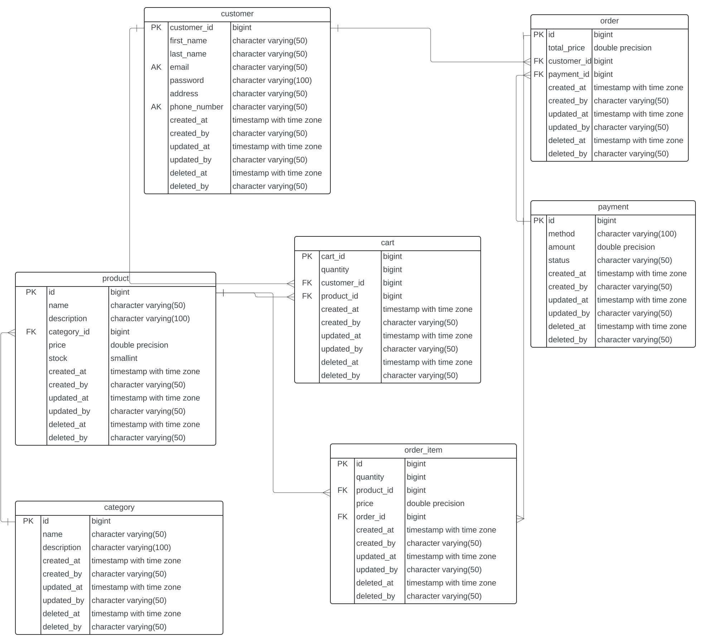
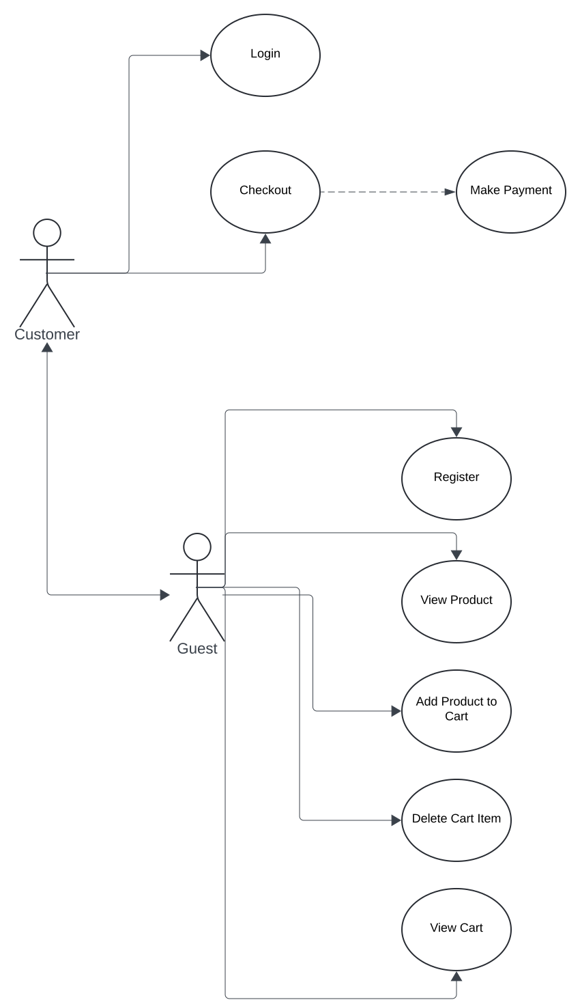

# Simple Online Store Backend

## Installation

### On Local machine
- Clone this repository
- Open the source code, open terminal and run <code> go mod tidy </code>
- Run <code>go run main.go</code>

## API Documentation
https://documenter.getpostman.com/view/25410438/2sA3dygqVA

## Entity Relationship Diagram

## Usecase Diagram

